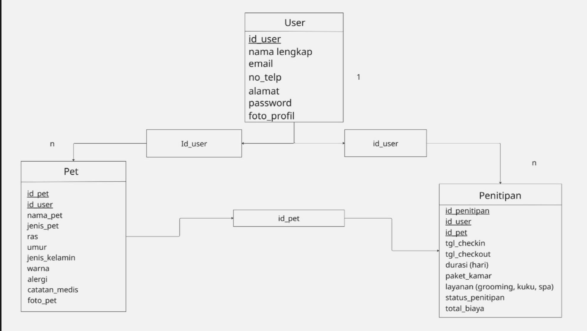

GET
1. /api/hewan → ambil daftar hewan
2. /api/penitipan/jumlah → total hewan dititip
3. /api/user/id → ambil data user tertentu

POST
1. /api/user/register → registrasi user
2. /api/hewan/tambah → tambah data hewan
3. /api/penitipan/tambah → tambah transaksi penitipan

